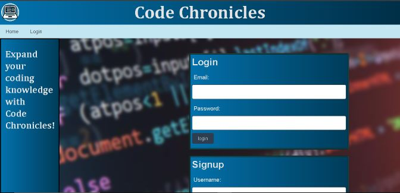
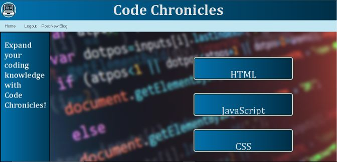
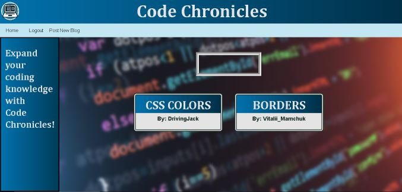
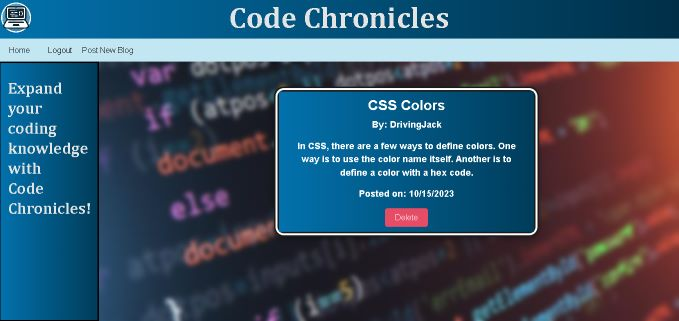
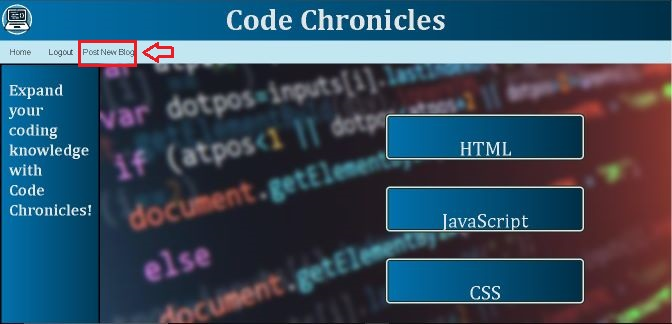

# Code Chronicles
  
  ## Description
  Code Chronicles is a blog website that showcases various topics pertaining to web developement. Users can view or post blog articles on whichever topic they choose.
  ## Table of Contents

  1. [Installation](#Installation)
  2. [Usage](#Usage)
  3. [License](#License)
  4. [Questions](#Questions)

  ## Installaion
  There is no installation required. Simply visit [Code Chronicles](https://code-chronicles.onrender.com/) online.
  
  ## Usage
  ### Viewing Blog Articles
  To use Code Chronicles users must either log in or create an account. 

  

  Once logged in, the home screen will show various topics of web developement. 

  

  From here, the user can choose a category by clicking on one of the category cards. The screen will then show the blog article cards under that category.
  
  

  Click one of the blog article cards to read it.

  

  ### Creating a New Blog

  To create a blog, Click "Post New BLog" in the top navigation menu.

  

  The user will fill out the form with a blog title, author name, selected category, and article content. After clicking the submit button, the article will be visible in its category page.
  
  ## License
  This software uses the MIT License.
  ## Questions
  To see more projects or to contribute, please visit: [Flem-House-Dev](https://github.com/Flem-House-Dev).
